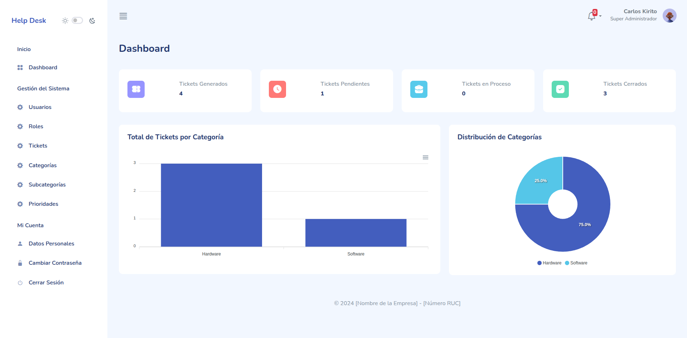

# Sistema Web de Help Desk

Es un sistema web desarrollado con PHP, MVC, JS, AJAX y con la Plantilla MAZER.



## Contenidos

- [Descripción](#descripción)
- [Motivación](#motivación)
- [Mejora Pendiente](#mejora-pendiente)
- [Roles de Usuario](#roles-de-usuario)
- [Acceso con Cuentas Predeterminadas](#acceso-con-cuentas-predeterminadas)
- [Características del Sistema](#características-del-sistema)
- [Plantilla Utilizada](#plantilla-utilizada)
- [Contribuciones](#contribuciones)
- [Instalación](#instalación)
- [Licencia](#licencia)
- [Contacto](#contacto)

## Descripción

Este sistema web es de código abierto y permite gestionar tickets generados por los empleados (usuarios finales) y asignar soporte técnico para resolver problemas tanto de software como de hardware. El sistema cuenta con varios roles, los cuales tienen diferentes niveles de acceso y funcionalidades dentro del sistema.

## Motivación

- Compartir mi proyecto en código abierto con la comunidad para aprender de la experiencia y mejorar continuamente el sistema. 
- Brindar una solución práctica para la gestión de tickets que pueda ser adaptada y utilizada en diferentes entidades o instituciones.

### Roles de usuario

- **Super Administrador**: Tiene control total sobre todas las funcionalidades del sistema y está restringido de ser eliminado. Además, tiene la capacidad de gestionar todos los roles, usuarios y configuraciones avanzadas del sistema.
- **Administrador**: Puede gestionar tickets, categorías, subcategorías y prioridades.
- **Soporte**: Puede gestionar los tickets asignados y comunicarse con los usuarios finales para la resolución de problemas. Este rol puede ver, enviar mensajes y cerrar o reabrir los tickets asignados.
- **Usuario Final**: Puede crear y hacer seguimiento de sus tickets, así como comunicarse con el equipo de soporte asignado para la resolución de los problemas.

### Acceso con cuentas predeterminadas

Estas cuentas de usuario están preconfiguradas únicamente para fines de demostración o prueba. Es importante cambiar los correos electrónicos y contraseñas antes de poner el sistema en producción para garantizar la seguridad de los datos.

- **Super Administrador**:
    - **Correo**: `carlos.kirito@example.com`
    - **Contraseña**: `123456`
    - **Rol**: Super Administrador
    
- **Administrador**:
    - **Correo**: `ana.sakura@example.com`
    - **Contraseña**: `123456`
    - **Rol**: Administrador

- **Soporte**:
    - **Correo**: `luis.saitama@example.com`
    - **Contraseña**: `123456`
    - **Rol**: Soporte

- **Soporte**:
    - **Correo**: `pedro.goku@example.com`
    - **Contraseña**: `123456`
    - **Rol**: Soporte

- **Usuario Final**:
    - **Correo**: `miguel.luffy@example.com`
    - **Contraseña**: `123456`
    - **Rol**: Usuario Final

- **Usuario Final**:
    - **Correo**: `maria.hinata@example.com`
    - **Contraseña**: `123456`
    - **Rol**: Usuario Final

## Características del Sistema

1. **Características del Panel de Administración**
    - Acceso al dashboard para visualizar resumen general de tickets.
    - Ver, crear, actualizar y eliminar usuarios.
    - Ver, crear, actualizar y eliminar roles.
    - Configurar permisos de acceso para cada rol (ver, crear, actualizar, eliminar).
    - Configurar permisos adicionales para la gestión de tickets.
    - Visualizar los tickets generados por los usuarios finales.
    - Crear nuevo ticket y asignar usuario final.
    - Asignar soporte al ticket.
    - Actualizar y eliminar tickets.
    - Cerrar y reabrir tickets.
    - Ver, crear, actualizar y eliminar categorías.
    - Ver, crear, actualizar y eliminar subcategorías.
    - Ver, crear, actualizar y eliminar prioridades.
    - Ver y actualizar sus datos personales.
    - Cambiar su contraseña.
    - Cerrar sesión de forma segura.

1. **Características para los Usuarios Finales**
    - Acceso al dashboard para visualizar resumen básico de sus tickets.
    - Crear nuevos tickets para enviar sus consultas de problemas, fallos o errores.
    - Ver una lista de todos los tickets generados, junto con información relevante como el estado actual del ticket y el soporte asignado.
    - Capacidad de ingresar a cada ticket para ver los detalles completos y comunicarse directamente con el soporte asignado.
    - Recibir notificaciones en el sistema web y por correo electrónico sobre actualizaciones de sus tickets.
    - Ver y actualizar sus datos personales.
    - Cambiar su contraseña.
    - Cerrar sesión de forma segura.

## Plantilla Utilizada

Este proyecto utiliza la plantilla **Mazer**, una plantilla gratuita de panel de administración basada en Bootstrap 5. Mazer ofrece un diseño fresco y elegante, adecuado para aplicaciones web tanto de uso personal como comercial.

Puedes encontrar más información sobre la plantilla Mazer en su [página oficial](https://zuramai.github.io/mazer/).

## Contribuciones

Las contribuciones son siempre bienvenidas. Si deseas contribuir, siéntete libre de contribuir en este repositorio. Cualquier contribución que hagas será muy apreciada.

Acepto contribuciones relacionadas con la mejora de funcionalidades, corrección de errores y nuevas ideas. No se aceptarán cambios que afecten negativamente la integridad del proyecto.

Si tienes alguna sugerencia que pueda mejorar esto, crea un fork del repositorio y una solicitud de incorporación de cambios. También puedes abrir un problema con la etiqueta "mejora". ¡No olvides darle una estrella al proyecto! ¡Gracias de nuevo!

1. **Haz un Fork del Proyecto**
    - Ve al repositorio y haz un fork para crear una copia del proyecto en tu cuenta de GitHub.

2. **Crea una Rama para tu Funcionalidad**
    - Crea una nueva rama para la funcionalidad que desees agregar o el error que quieras corregir. El nombre de la rama debe estar en inglés y seguir la convención `feature/nombre-de-la-funcionalidad` para nuevas funcionalidades o `bugfix/nombre-del-error` para correcciones de errores. Por ejemplo:

        ```bash
        git checkout -b feature/new-dashboard
        ```
        o

        ```bash
        git checkout -b bugfix/fix-login-issue
        ```

3. **Realiza los Cambios**
- Realiza los cambios necesarios en el código o agrega nuevas funcionalidades.

4. **Haz Commit de tus Cambios**
    - Después de realizar los cambios, confirma los mismos con un mensaje claro que explique lo que se ha modificado:

        ```bash
        git commit -m 'Agregar nueva funcionalidad para el dashboard'
        ```

5. **Sube tus Cambios**
    - Sube tus cambios a tu repositorio de GitHub:
    
        ```bash
        git push origin feature/new-dashboard
        ```

6. **Abre un Pull Request**
    - Abre un Pull Request para que pueda revisar tus cambios. Asegúrate de describir brevemente lo que has cambiado.

## Instalación

Sigue estos pasos para instalar y configurar el sistema web de Help Desk:

1. **Clonar el repositorio**

    ```bash
    git clone https://github.com/iadataweb/master-web-help-desk-php-mvc.git
    ```

2. **Configurar la base de datos**
- Crea una nueva base de datos en tu servidor MySQL llamada master_help_desk_001.
- Ve a la carpeta 'Database' y abre el archivo 'master_help_desk_001.sql'.
- Copia el contenido del archivo.
- Abre phpMyAdmin, selecciona la base de datos master_help_desk_001 y dirígete a la pestaña SQL.
- Pega la consulta copiada en el editor de SQL y haz clic en Continuar para crear las tablas y registros iniciales.

3. **Configurar el archivo de conexión**
Ingresa en la carpeta 'Config'y abre el archivo 'System.php' y edita las credenciales de la base de datos según tu configuración local (nombre de host, usuario, contraseña).

4. **Configurar el archivo `.env`**
- Crea un archivo llamado `.env` en la raíz del proyecto.
- Añade las siguientes líneas y reemplaza con tu propio correo de Gmail y la contraseña de aplicación generada:
    ```env
    # CUENTA DE ACCESO PARA EL ENVÍO DE CORREO
    EMAIL_USERNAMER="su_correo@gmail.com"
    EMAIL_PASSWORDR="contraseña_de_aplicación"
    ```
- **Nota**: Es importante usar una **contraseña de aplicación** en lugar de tu contraseña habitual de Gmail por motivos de seguridad. Puedes generar una contraseña de aplicación siguiendo este [tutorial en YouTube](https://youtu.be/cygY1sCjLxA).

5. **Ejecutar el servidor**
- Inicia tu servidor web local (por ejemplo, XAMPP o WAMP) y asegúrate de que el servicio MySQL esté corriendo.
- Accede a la aplicación a través de tu navegador en 'http://localhost/master-web-help-desk-php-mvc'.

¡Listo! Ahora deberías poder utilizar el sistema web de Help Desk.

## Licencia

El proyecto es de código abierto bajo la licencia MIT. Puedes ver más detalles en el archivo [LICENSE](LICENSE).

## Contacto

Carlos Injante - [LinkedIn](https://www.linkedin.com/in/20ismael1999/)

<p align="center">¡Gracias por visitar mi proyecto!</p>